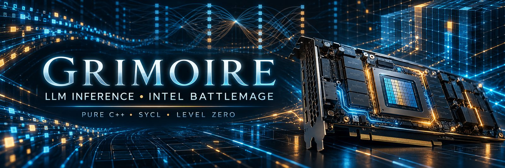

# GRIMOIRE

**LLM inference built for Intel Arc Pro B70 Battlemage GPUs.**

GRIMOIRE is a native inference engine written in C++ with SYCL and Level Zero. It is being developed to run and optimize large language models directly on Intel Battlemage hardware, with a focus on the Arc Pro B70.

The aim is straightforward: make high-performance local LLM inference possible on this hardware, using kernels and memory paths designed for the GPU instead of relying on a general-purpose inference stack.

> **Project status:** Active development. The repository contains the engine and its ongoing optimization work. A ready-to-use inference image or downloadable model package will be added here later.

## Why GRIMOIRE was created

Most inference tooling and performance guidance is centered on other GPU platforms. Battlemage owners need an engine that treats Intel hardware as a first-class target and makes its real performance measurable.

GRIMOIRE began as a ground-up inference project for the Arc Pro B70. Building the engine directly exposed important details that a port or a high-level wrapper could hide: how the GPU represents quantized weights, where attention kernels can go wrong, how to keep decode bound by useful memory traffic, and what multi-GPU communication actually costs on this setup.

The project exists to turn those findings into working inference code, reproducible checks, and practical performance improvements for Battlemage users.

## What it is for

- Running supported large language models locally on Intel Arc Pro B70 GPUs.
- Exploring native C++ / SYCL / Level Zero kernels for model inference.
- Measuring prefill and token-generation performance on real hardware.
- Improving single-GPU execution and developing multi-GPU paths for models that need more memory.
- Checking changes against a growing set of model and checkpoint combinations.

GRIMOIRE is a hardware-focused inference engine, not a hosted model service. Model compatibility and performance depend on the architecture, weight format, configuration, and hardware available.

## How it is built

- **C++** inference engine
- **SYCL** GPU programming
- **Level Zero** device runtime
- **Intel Battlemage**, with the Arc Pro B70 as the primary target
- Custom GPU work for operations such as attention, matrix multiplication, quantized weight handling, and mixture-of-experts layers

The project aims to keep inference native to the target hardware and does not use vLLM, PyTorch, or OpenVINO as its inference backend.

## Recent measured results

These are results recorded in the linked project commits on the developer's Arc Pro B70 system. They are examples from specific models and test runs, not universal performance guarantees.

| Workload | Recorded result | Context |
|---|---:|---|
| Ornith-1.5-35B-A3B token generation | **198.6 tokens/s** | Single B70; 256 generated tokens in the recorded run. [Commit](https://github.com/doopeworld/GRIMOIRE/commit/9cd4a9191ea4ee704f9214861b3cb1c9802b3291) |
| Ornith-1.5-35B-A3B prefill | **10,030–10,165 tokens/s** | Two-GPU pipeline-parallel run, 5,987-token prompt. Output matched the single-B70 run for the checked text. [Commit](https://github.com/doopeworld/GRIMOIRE/commit/b970875d52cf3e6cea8d354808dd7ab5ff030323) |
| TP decode communication batching | **59.3–60.0 tokens/s** | Recorded TP run after combining independent projection gathers; see the commit for the setup and comparison. [Commit](https://github.com/doopeworld/GRIMOIRE/commit/33757bb631606293a3af87ab76409c479a3c3015) |

The two-GPU figures demonstrate an actively developed path. Tensor and pipeline parallelism are intended for models that need multiple GPUs for capacity; they are not automatically faster for a model that already fits on one card.

Results change as kernels and test coverage evolve. The commit links include the measurements, validation notes, and limitations for each change. The latest model-zoo audit reports **27 confirmed working model/checkpoint combinations** in the local regression sweep, with additional formats and configurations correctly identified as out of scope. [Latest audit](https://github.com/doopeworld/GRIMOIRE/commit/994072e2b75362071eb40aa39455b6a0476c9f2d)

## Getting started

The engine and build scripts are in this repository. A packaged inference image and a simple download-and-run path for users will be published here when they are ready. Until then, use the repository's current build instructions and check the project status before choosing a model or format.

## Development notes

GRIMOIRE is under active development. Model support, build requirements, and performance may change as the engine evolves. Benchmarks should be read with their linked commit notes, which record the model, test conditions, correctness checks, and known trade-offs.

## Links

- [Source code](https://github.com/doopeworld/GRIMOIRE)
- [Recent commits](https://github.com/doopeworld/GRIMOIRE/commits/main)
- [Issues](https://github.com/doopeworld/GRIMOIRE/issues)
